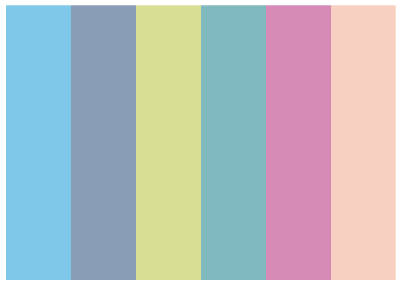
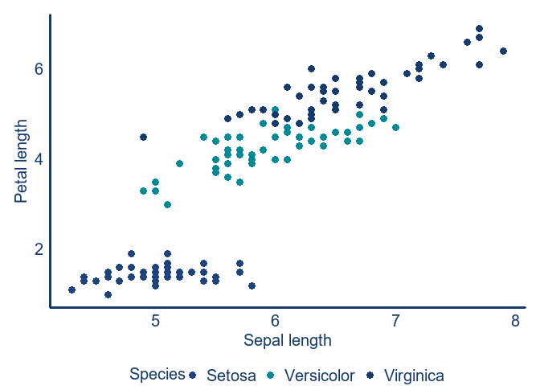
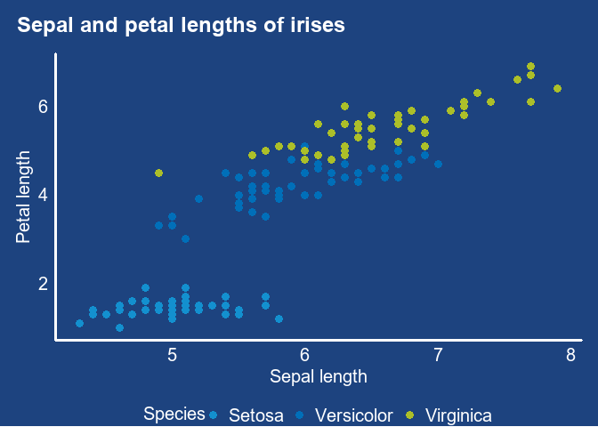
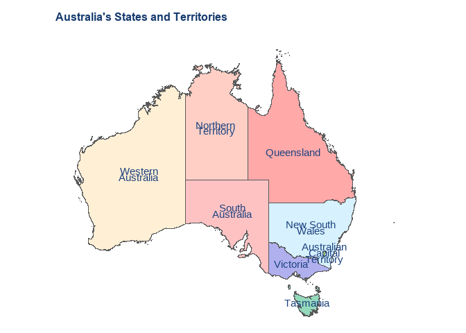
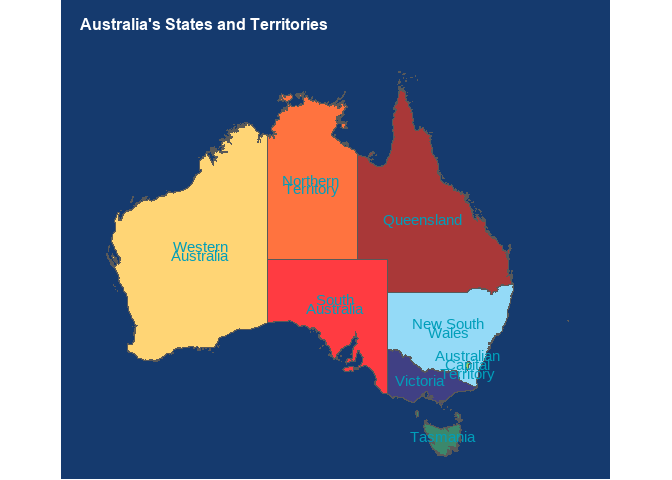
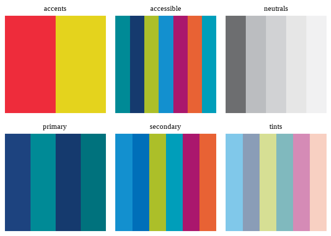
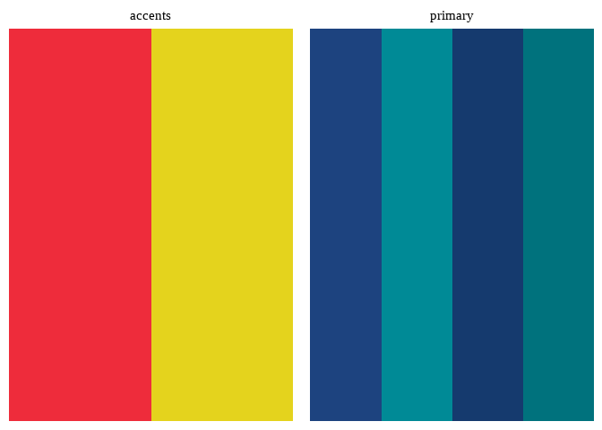

<!-- README.md is generated from README.Rmd. Please edit that file -->

# dohactheme

<!-- badges: start -->
<!-- badges: end -->

The Department of Health and Aged Care’s colours play an important role
in the Department’s identity.

The main purpose of dohactheme is to enable R users in Australian public
policy to use the colours and styles defined in DoHAC’s Style Sheet to
create compliant visualisation in ggplot.

dohactheme was created with the **palettes** package, which provides a
comprehensive library for colour vectors and colour palettes using a new
family of colour classes (`palettes_colour`, and `palettes_palette`)
that always print as hex codes with colour previews. Colour palette
packages created with palettes have access to the following
capabilities, all without requiring you to write any code: formatting,
casting and coercion, extraction and updating of components, plotting,
colour mixing arithmetic, and colour interpolation.

See the following vignettes to learn how to use palletes with other
packages:

- [Using palettes with
  ggplot2](https://mccarthy-m-g.github.io/palettes/articles/ggplot2.html)
- [Using palettes with
  gt](https://mccarthy-m-g.github.io/palettes/articles/gt.html)
- [Using palettes with
  biscale](https://mccarthy-m-g.github.io/palettes/articles/biscale.html)
- [Compatibility with other colour
  packages](https://mccarthy-m-g.github.io/palettes/articles/compatibility.html)

## Included Colours

### Primary colours

DoHAC’s primary colour palette comprises blue and teal, with a secondary
dark shade of both.

### DoHAC blue and dark blue

    #> Loading required package: palettes


### DoHAC teal and dark teal


## Secondary colours

DoHAC’s secondary colours `dohac_colours$secondary` add further shades
of blue and teal, as well as pink and orange.


## Secondary tints

DoHAC’s secondary colours are complemented by a series of tints
`dohac_colours$tints` of the same colours.



## Neutrals

DoHAC’s neutral colours are a series of 5 grey shades
`dohac_colours$neutrals` .


## Accents

DoHAC’s accents colours `dohac_colours$accents` are red and yellow.


## Accessible

DoHAC’s brand palettes can be hard to differentiate when used
individually in charts and other infographics. We have chosen a
selection of colours with higher contrast and grouped them as
`dohac_colours$accessible`. This palette is subject to revision based on
feedback and testing


## Installation

You can install the development version of DoHACpalette from
[GitHub](https://github.com/) with:

``` r
# install.packages("devtools")
devtools::install_github("zerogetsamgow/dohactheme")
```

## Usage

{dohactheme} is designed to produce {gglot2} that comply with the DoHAC
style guide simply. For example.

``` r

## basic example code
ggplot2::ggplot(data=iris,aes(x=Sepal.Length, y = Petal.Length,colour=Species)) +
  geom_point(size=3) +
  scale_colour_manual(values=dohac_colours$primary,labels=stringr::str_to_title) +
  scale_x_continuous(name="Sepal length")+
  scale_y_continuous(name="Petal length")+
  theme_dohac_white()
```



{dohactheme} exports two themes - `theme_dohac_white()`(seen above) and
`theme_dohac_blue()` to enable plots to be produced for any DoHAC
publication.

``` r
## basic example of a green plot
ggplot(data=iris,aes(x=Sepal.Length, y = Petal.Length,colour=Species)) +
  geom_point(size=3) +
  scale_colour_manual(values=dohac_colours$secondary,labels=stringr::str_to_title) +
  scale_x_continuous(name="Sepal length")+
  scale_y_continuous(name="Petal length")+
  labs(title="Sepal and petal lengths of irises")+
  theme_dohac_blue()
```



As well as utilising DoHAC coloutes these themes are rendered using the
`Helvetica neue` font.

## Maps

{dohactheme} exports a theme - `theme_dohac_map()` to be used when
plotting maps. This theme can be produced with white or blue
backgrounds. White is the default.

    #> Linking to GEOS 3.11.2, GDAL 3.7.2, PROJ 9.3.0; sf_use_s2() is TRUE

``` r

## basic example of a map with grey background
ggplot(
  data = 
    strayr::read_absmap(
      name="state2021",
      remove_year_suffix = TRUE
      ) |> 
    filter(state_name %in% strayr::state_name_au) |> 
    mutate(state_name = 
             factor(
               state_name, 
               levels=strayr::state_name_au)
           ),
  aes(fill=state_name, x=cent_long, y =cent_lat, label = str_wrap(state_name,10))) +
  geom_sf() +
  geom_text(colour = dohac.blue, lineheight=.5)+
  scale_fill_manual(guide='none',values=colorspace::lighten(strayr::palette_state_name_2016,.7)) +
  labs(title="Australia's States and Territories")+
  theme_dohac_map(base_colour = "white", base_size = 10)
```



``` r

## basic example of a map with grey background
ggplot(
  data = 
    strayr::read_absmap(
      name="state2021",
      remove_year_suffix = TRUE
      ) |> 
    filter(state_name %in% strayr::state_name_au) |> 
    mutate(state_name = 
             factor(
               state_name, 
               levels=strayr::state_name_au)
           ),
  aes(fill=state_name, x=cent_long, y =cent_lat, label = str_wrap(state_name,10))) +
  geom_sf() +
  geom_text(colour = dohactheme::dohac.lightteal, lineheight=.5)+
  scale_fill_manual(guide='none',values=colorspace::lighten(strayr::palette_state_name_2016,.2)) +
  labs(title="Australia's States and Territories")+
  theme_dohac_map(base_colour = "blue", base_size = 10)
#> Reading state2021 file found in C:\Users\SAMUEL~1\AppData\Local\Temp\RtmpQX1Zrn
```



DoHAC palette comes with a set of 6 discrete colour palettes, and 2
sequential colour palettes, which can be accessed from the following R
objects:

- `dohac_colours` for discrete palettes
- `dohac_palettes` for discrete and sequential palettes

### Discrete

Discrete palettes matching the above groups - `primary`, `secondary`,
`tints`,`neutrals` and `accents`.

``` r
plot(dohac_colours[1:5])
```


### Tints

For long form documents infographics and charts, tints from the DoHAC
colour palette can be used in 20 per cent increments.
`dohac_palettes$blues` and `dohac_palettes$teals` are populated with
compliant `blue` and `teal` shades.

``` r
plot(dohac_colours)
```



Palettes can be subset using `[`, `[[`, and `$`.

- To extract one or more palettes use `[`:

  ``` r
  plot(dohac_palettes[c("primary", "accents")])
  ```

  

- To extract a single palette as a colour vector use `[[` or `$`:

  ``` r

  plot(dohac_palettes[["teals"]])
  ```

  

  ``` r
  plot(dohac_palettes$blues)
  ```

  

- To get names of palettes use `names()`:

  ``` r
  names(dohac_palettes)
  #> [1] "primary"    "secondary"  "tints"      "neutrals"   "accents"   
  #> [6] "accessible" "blues"      "teals"
  ```

## Documentation

See also documentation for the palettes package at
[`https://mccarthy-m-g.github.io/palettes/`](https://mccarthy-m-g.github.io/palettes/reference/index.html)
or in the installed package: `help(package = "palettes")`.
